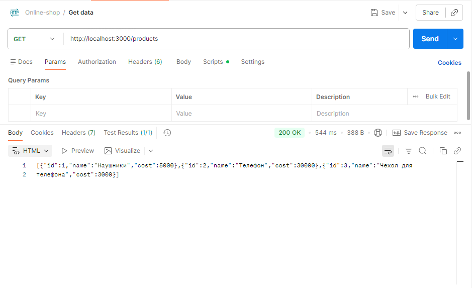
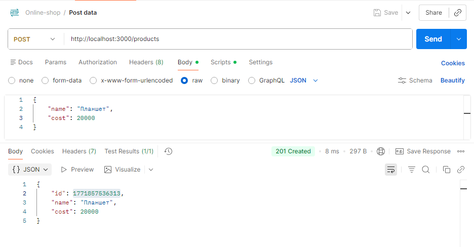
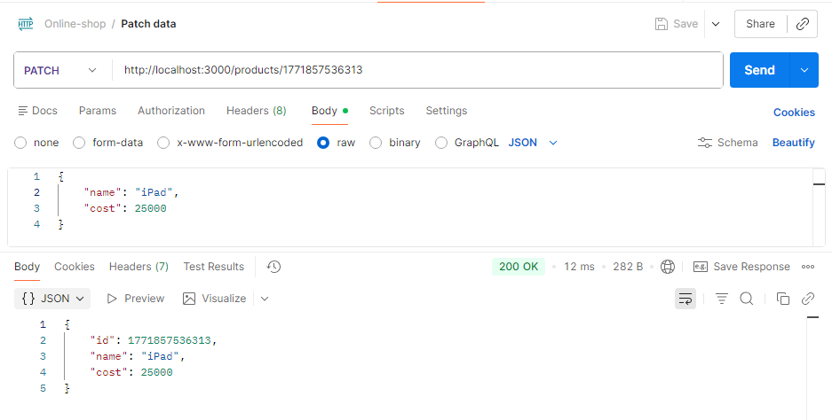
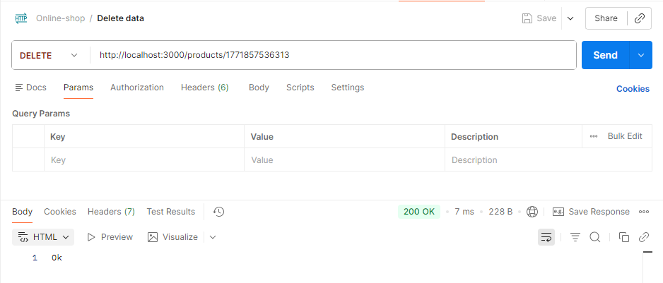
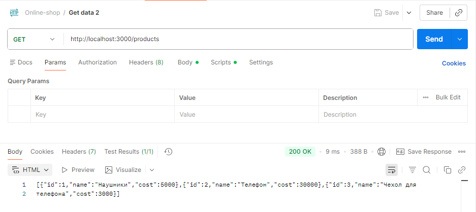
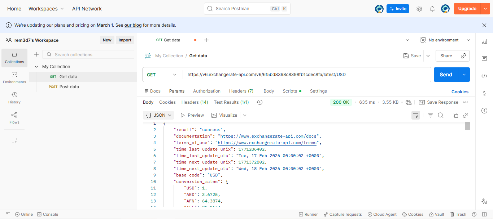
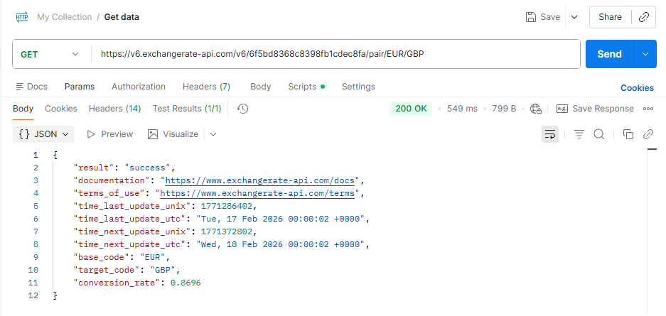
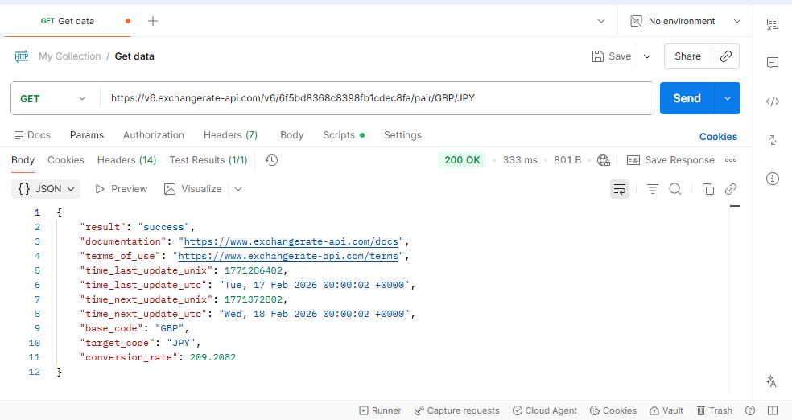
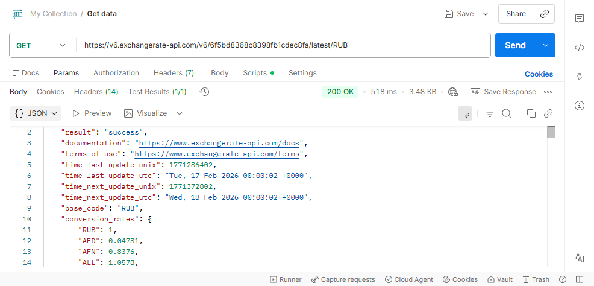
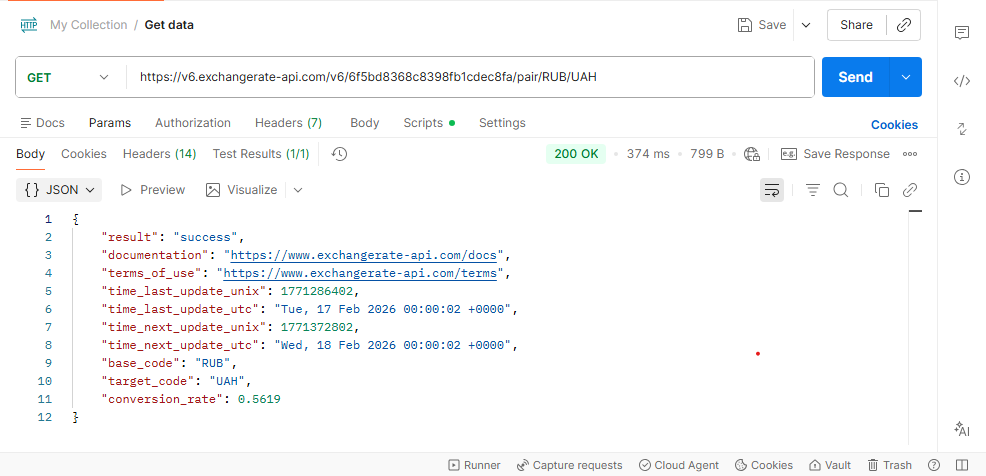

# Практическая работа №3

## Тестирование своего API

Запрос 1 (получить все продукт)

Запрос 2 (добавить новый продукт)

Запрос 3 (изменить данные продукта)

Запрос 4 (удалить продукт)

Проверка запроса 4

## Запросы к внешнему API (ExchangeRate-API)
Запрос 1

Запрос 2

Запрос 3

Запрос 4

Запрос 5

